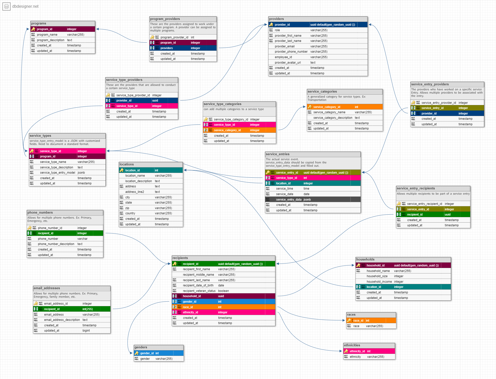

# Family Promise Service Tracker

[Family Promise](https://familypromise.org/) helps local communities coordinate their compassion to address the root causes of family homelessness. They tap existing local resources to empower families towards economic stability. Families come to them in crisis; they help them rebuild their lives with new skills and ongoing support. They address the issue holistically, providing prevention services before families reach crisis, shelter and case management when they become homeless, and stabilization programs once they have secured housing to ensure they remain independent.

Family Promise needs a way to track and visualize the services they provide external to the shelter to gain actionable insights.

Our goal is to build a generalizable monitoring and evaluation (M&E) platform that meets Family Promise's needs, with an eye toward additional potential use cases that would be useful for many other organizations.

## Schema

[ DB Designer Schema Link](https://dbdesigner.page.link/KdYw5jrqdVDgWU3a8)

## Status

Deployed here: [https://fp-service-tracker.herokuapp.com/](https://fp-service-tracker.herokuapp.com/)

**_Needs Updating_** Current Roadmap in [Notion](https://www.notion.so/Roadmap-Family-Promise-Service-Tracker-Labs-33-301d3f1b37564f11b6e0a399a5ca8365), all activity tracked in [Trello](https://trello.com/b/8Y9zYr3n/family-promise-service-tracker-labs-33).

## Requirements

Details on the Labs Node Scaffolding here: <https://docs.labs.lambdaschool.com/labs-api-strarter/>

Labs teams must follow all [Labs Engineering Standards](https://labs.lambdaschool.com/topics/node-js/).

## Documentation

- The documentation for how to work with the JSONB column used for Service Entry data and type models, check out **/docs/API-README-SERVICE-ENTRIES.md**
- The current API documentation is found in **/docs/API-README.md**
- List of known issues is found in **/docs/known-defects.md**
- Pull Request Template found in **/docs/pull_request_template.md**

## Getting Started

### Enviornment Variables

- `PORT` - API port (optional, but helpful with FE running as well)
  - The following ports are whitelisted for use with okta
    - 3000
    - 8000
    - 8080
- `DS_API_URL` - URL to a data science api. (eg. <https://ds-bw-test.herokuapp.com/>)
- `DS_API_TOKEN` - authorization header token for data science api (eg. SUPERSECRET)
- `DEV_DATABASE_URL` - connection string for local postgres database
- `OKTA_URL_ISSUER` - The complete issuer URL for verifying okta access tokens. `https://example.okta.com/oauth2/default`
- `OKTA_CLIENT_ID` - the okta client ID.
- `OKTA_ORG_URL` - The base url for the Okta org
- `OKTA_API_TOKEN` - Okta API token

See .env.sample for example values

### Setup postgres

There are 3 options to get postgresql installed locally [Choose one]:

1. Use docker. [Install](https://docs.docker.com/get-docker/) for your platform
   - run: `docker-compose up -d` to start up the postgresql database and pgadmin.
   - Open a browser to [pgadmin](http://localhost:5050/) and you should see the Dev and Test server already defined.
   - If you need to start over you will need to delete the folder `$ rm -rf ./data/pg` as this is where all of the server data is stored.
   - if the databases `api-dev` and `api-test` were not created then you'll need to start over. You may need to grant system execution access to the .sh file in docker/pg/pg-init-scripts:
   - - Run following from within root: `chmod +x ./docker/pg/pg-init-scripts/create-multiple-postgresql-databases.sh`
2. Download and install postgresql directly from the [main site](https://www.postgresql.org/download/)
   - make note of the port, username and password you use to setup the database.
   - Connect your client to the server manually using the values previously mentioned
   - You will need to create a database manually using a client.
   - Make sure to update the DATABASE_URL connection string with the values for username/password, databasename and server port (if not 5432).
3. Setup a free account at [ElephantSQL](https://www.elephantsql.com/plans.html)
   - **_Downside_**: JSONB column displays as `[object Object]`, so not good when testing/creating JSON queries
   - Sign up for a free `Tiney Turtle` plan
   - copy the URL to the DATABASE_URL .env variable
   - make sure to add `?ssl=true` to the end of this url

### Setup the application

- create your project repo by forking or using this as a template.
- run: `npm install` to download all dependencies.
- run: `cp .env.sample .env` and update the enviornment variables to match your local setup.
- run: `npm run knex migrate:latest` to create the starting schema.
- run: `npm run knex seed:run` to populate your db with some data.
- run: `npm run tests` to confirm all is setup and tests pass.
- run: `npm run watch:dev` to start nodemon in local dev enviornment.
